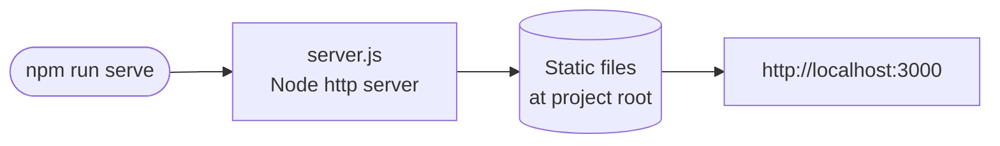
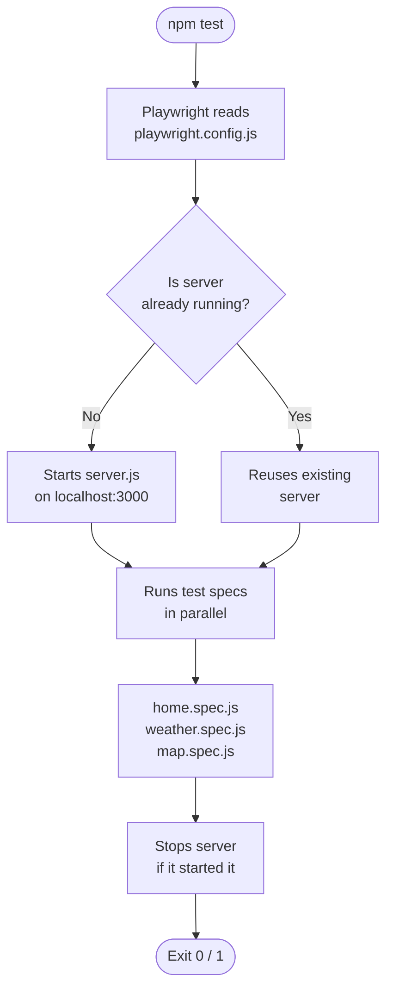
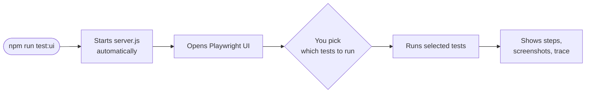
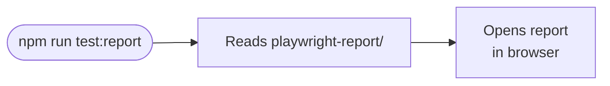
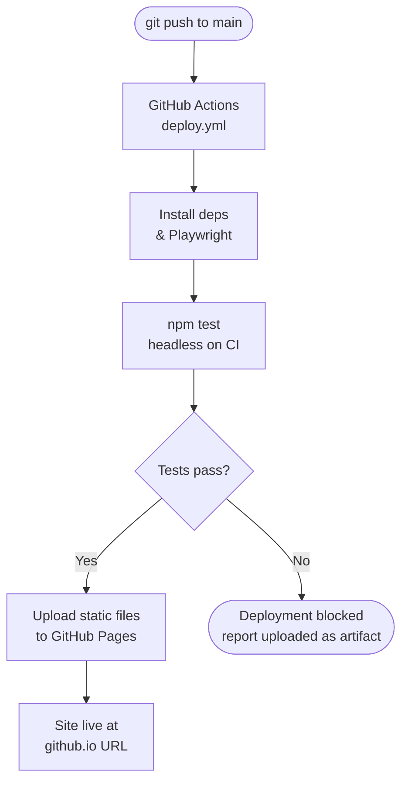

# Claude Code Experiments

A personal playground for small interactive experiments, all built through conversations with [Claude Code](https://claude.ai/code). Deployed as a static site on GitHub Pages.

## Pages

| Page | Description |
|------|-------------|
| `index.html` | Home — lists all experiments |
| `weather.html` | Live weather for Zaragoza via [Open-Meteo API](https://open-meteo.com/) |
| `map.html` | Interactive map of Mesones de Isuela via [Leaflet.js](https://leafletjs.com/) + OpenStreetMap |

## Development

**Requirements:** Node 20 (use `nvm use` in the project directory)

```bash
# Install dependencies and Playwright browser (first time only)
npm install
npx playwright install chromium
```

### `npm run serve`

Starts a local static file server. Use this to manually browse the site before committing.



### `npm test`

Runs all Playwright tests in headless mode. **No manual server needed** — Playwright reads `playwright.config.js` and launches `server.js` automatically before the tests start, then shuts it down when they finish.



> This is purely local. Nothing is deployed — the tests run against your machine.

### `npm run test:ui`

Same as `npm test` but opens the Playwright interactive UI, where you can run individual tests, inspect steps, and see screenshots.



### `npm run test:report`

Opens the HTML report from the **last** `npm test` run in your browser. Does not run any tests or start any server.



## Test structure

```
tests/
├── pages/           # page objects (BasePage, HomePage, WeatherPage, MapPage)
└── specs/           # one spec per HTML page
```

## Deployment

Pushes to `main` trigger the GitHub Actions workflow (`.github/workflows/deploy.yml`), which runs tests and deploys to GitHub Pages only if they pass.



> GitHub Pages source must be set to **GitHub Actions** in `Settings → Pages`.
